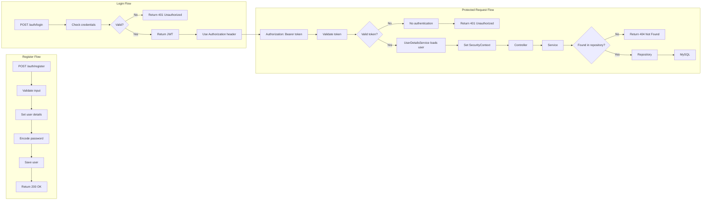

# Finance Tracker

Finance Tracker is a Spring Boot application that handles user creation, transaction logging, and spending summaries. This project was built to learn Spring Boot, Spring Security, and JWT authentication.

## Tech Stack

- Java 21
- Spring Boot 3.x
- Spring Security
- Spring Data JPA
- MySQL
- JWT
- Lombok
- Maven
- JUnit
- Mockito
- Swagger
- Postman
- IntelliJ IDEA Community Edition

## Features

- Secure user registration and login with JWT-based authentication
- Password hashing with BCrypt
- Full CRUD operations for users, categories, and transactions
- Financial summary endpoint for calculating total income, expenses, and balance
- Stateless authentication with JWT
- Layered controller-service-repository architecture
- MySQL persistence with JPA/Hibernate
- API documentation with Swagger
- Unit-tested service layer with JUnit and Mockito

## Architecture Diagram



## Setup

1. Clone the repository.
2. Create the MySQL database:

   ```sql
   CREATE DATABASE financetracker;
   ```

3. Ensure `application.properties` contains the necessary database and application settings.
4. Run the application on port `8080`.

## API Endpoints

### Public

| Action | Method | Endpoint |
| --- | --- | --- |
| Register | POST | `/auth/register` |
| Login | POST | `/auth/login` |

### Protected

#### Categories

| Action | Method | Endpoint |
| --- | --- | --- |
| Create category | POST | `/api/categories` |
| Get category | GET | `/api/categories/{id}` |
| Get all categories | GET | `/api/categories` |
| Update category | PUT | `/api/categories/{id}` |
| Delete category | DELETE | `/api/categories/{id}` |

#### Transactions

| Action | Method | Endpoint |
| --- | --- | --- |
| Create transaction | POST | `/api/transactions` |
| Get transaction | GET | `/api/transactions/{id}` |
| Get all transactions | GET | `/api/transactions` |
| Get transactions by user | GET | `/api/transactions/user/{id}` |
| Get transactions by category | GET | `/api/transactions/category/{id}` |
| Update transaction | PUT | `/api/transactions/{id}` |
| Delete transaction | DELETE | `/api/transactions/{id}` |

#### Users

| Action | Method | Endpoint |
| --- | --- | --- |
| Create user | POST | `/api/users` |
| Get user | GET | `/api/users/{id}` |
| Get all users | GET | `/api/users` |
| Get user summary | GET | `/api/users/summary/{id}` |
| Update user | PUT | `/api/users/{id}` |
| Delete user | DELETE | `/api/users/{id}` |

## Authentication Flow

Register with a username and password, then log in with the same credentials. After logging in, the API returns a JWT that can be passed in the `Authorization` header for protected requests.

## Swagger

Swagger is available once the app is running:

```text
http://localhost:8080/swagger-ui/index.html
```

## Testing

Tests can be run individually in IntelliJ IDEA by clicking the green run icon next to each test method.
